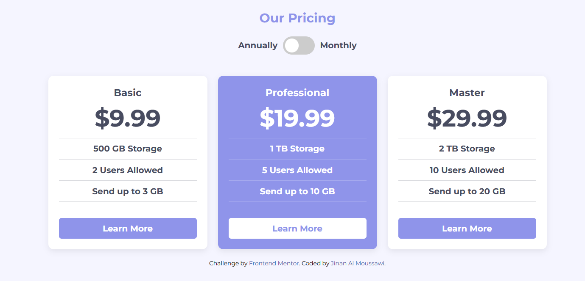
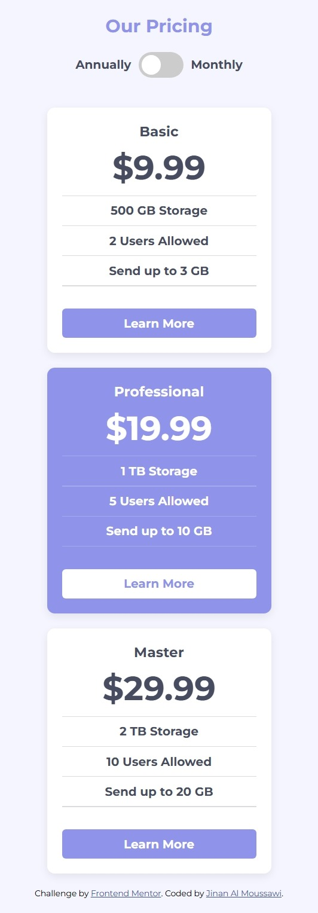

# Frontend Mentor - Pricing Component with Toggle 🎚️

## 📍 Overview

This is my solution to the [Pricing Component with Toggle challenge on Frontend Mentor](https://www.frontendmentor.io/challenges/pricing-component-with-toggle-8vPwRMIC). The goal was to build a responsive pricing card layout that includes a toggle switch to change between annual and monthly billing.

## ✅ Features

- 🔁 Toggle between **annual** and **monthly** pricing.
- 📱 Fully **responsive layout** for desktop and mobile.
- 🎯 Built with **semantic HTML**, **modern CSS**, and **accessible toggle switch**.
- 💡 Highlighted pricing plan for better visual emphasis.
- ⚡ Clean and reusable CSS with custom properties (CSS variables).

---

## 🛠️ Built With

- Semantic **HTML5**
- Modern **CSS3** (Flexbox, variables, media queries)
- Minimal **JavaScript** (if dynamic pricing is added)
- [Google Fonts - Montserrat](https://fonts.google.com/specimen/Montserrat)

---

## 📸 Screenshots

### 💻 Desktop view

### 📱 Mobile view

---

## 🚀 Live Demo

🔗 [View Live Site]([https://Jinan47.github.io/pricing-tables](https://pricing-tables-kappa.vercel.app/))
📂 [View on GitHub](https://github.com/Jinan47/pricing-tables)

---

## 🧠 What I Learned

- How to build a pricing toggle switch UI from scratch using HTML/CSS
- Clean component design and styling reuse using **utility-first CSS**
- Structuring responsive layouts with **Flexbox** and media queries
- Custom toggle switches with pure CSS using `input[type="checkbox"] + .slider`

---

## 📬 Author

- Frontend Mentor – [@Jinan47](https://www.frontendmentor.io/profile/Jinan47)
- GitHub – [@Jinan47](https://github.com/Jinan47)

---
